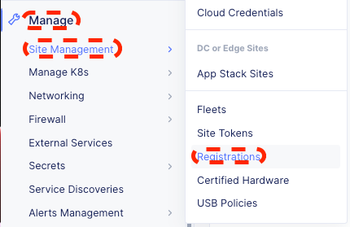
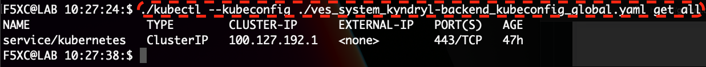

<h2>F5 Distributed Cloud Customer Sites (Cloud or Edge) App Stack</h2>

<h3>Edge Application Platform</h3>

 

 
<h3>Table of Contents</h3>
<a href="#pre">PRE-REQUISITE<a> 
<a href="#apc">SECTION 1: Prepare App Stack CE Sites</a> 
<a href="#dap">SECTION 2: Deploy the sample Frontend and Backend apps to the App Stack at Customer Sites</a> 
<a href="#cap">SECTION 3: Connect Backend App to Frontend App</a> 
<a href="#cwp">SECTION 4: Configure WAAP</a> 
<a href="#k8s">SECTION 5: Quick Comparison on generic Kubernetes Deployment vs XC vK8s (App Stack)</a> 
<a href="#ack">ACKNOWLEDGEMENT</a> 
 
<h4><a id="pre">PRE-REQUISITE</a></h4>
•	F5 Distributed Cloud credential 
•	Laptop/desktop browser with internet connectivity 
•	Two VMs, either on public cloud or on-premise (VMware/KVM) 
 
<a href="#toc">Table of Content</a>
 
<h4>SECTION 1: Prepare App Stack CE Sites</a></h4>
This section focusses on setting up customer sites (Cloud or Edge) VMs  
1.1) Login to XC account at https://console.ves.volterra.io (Lab tenant will be provided) 
  
1.2) Prepare 2x CE sites in VMware/KVM/Public Cloud (min 4vCPU, 16GB, 64GB storage), totally isolated network environment like VPC/vNET or can be in the same subnet for on-premise 
 
1.3) Navigate to: 

 

1.4) Create/Retrieve your Site Token: Manage > Site Management > Site Tokens (Add new Site Token with Name format like yourname-token e.g., kyndryl-token, copy the UID value once Site Token created for later use) 

 

1.5) Create K8s Cluster: Manage > Manage K8s > K8s Clusters (Add two new Clusters with Name frontend and backend, keep the Name consistent and the same for K8s Cluster, App Stack, and the CE Cluster Name of the App Stack) 

 
 

 
 

1.6) Create App Stack Site: Manage > Site Management > App Stack Sites (Add two new App Stack Sites with Name - frontend and backend) 

 

 

1.7) Use the Site Token UID value copied earlier to initialise the two Customer Sites (Cloud or Edge) 

1.8) Instantiate two Customer Sites (Cloud or Edge) for both App Stack Sites. If using Public Cloud like AWS/Azure/GCP then create cloud credential, otherwise download KVM/VMware <a href="https://docs.cloud.f5.com/docs/images">images</a> and bring up the two VMs with Internet connectivity 

1.9) Remote login into two Customer Sites (Cloud or Edge) VMs to complete the CE configuration (E.g., ssh admin@privateipaddress with default password, a mandatory password change will be prompted - enter existing and desire new password) 

1st CE, enter/select following values and leave other values default (Latitude / Longtitude to chart CE location on F5XC map - enter your desire values)
| Field | Value | 
| --------------- | --------------- |
| Token | Site Token UID value copied earlier |
| Cluster Name | frontend |
| Hostname | frontend |
| Certified Hardware | kvm-voltstack-combo |
| Primary Outside NIC | eth0 |
| Latitude / Longtitude | 1.28 / 103.9 |

2nd CE, enter/select following values and leave other values default (Latitude / Longtitude to chart CE location on F5XC map - enter your desire values)
| Field | Value | 
| --------------- | --------------- |
| Token | Site Token UID value copied earlier |
| Cluster Name | backend |
| Hostname | backend |
| Certified Hardware | kvm-voltstack-combo |
| Primary Outside NIC | eth0 |
| Latitude / Longtitude | 1.28 / 103.9 |

1.10) Approve New Site Registration: Manage > Site Management > Registrations (Click on the two green ticks on 1st and 2nd CEs to approve the registrations) 
 
The New Sites will be moved to Other Registrations after approval 
 
Monitor the New Sites status: Sites > Site List (Until there are online and turned green) 
  

<h4>SECTION 2: Deploy the sample frontend and backend apps to the App Stack at Customer Sites</a></h4>
This section focusses on deploying sample application into customer sites (Cloud or Edge) running App Stack 
 
2.1) Download the Global Kubeconfig files from both sites: Managed K8s > Overview 

 

2.2) Download kubectl binary <a href="https://kubernetes.io/docs/tasks/tools/#kubectl">tool</a> on your laptop (OS supported - Windows/Mac/Linux) 

2.3) Test kubectl connectivity to the 1st CE K8s cluster with downloaded kubectl binary and Global Kubeconfig file, example of Linux command: 
./kubectl --kubeconfig ./ves_system_kyndryl-frontend_kubeconfig_global.yaml get all 
 

2.4) Test kubectl connectivity to the 2nd CE K8s cluster with downloaded kubectl binary and Global Kubeconfig file and kubectl binary, example of Linux command: 
./kubectl --kubeconfig ./ves_system_kyndryl-backend_kubeconfig_global.yaml get all 
 

2.5) To view the name of your F5XC application namespace: Distributed Apps > (refer to breadcrumb value on top) > Sites 
 

2.6) Create your frontend (1st CE) Kubernetes namespace (using the same name as your F5XC application namespace observed at previous step), example of Linux command: 
./kubectl --kubeconfig ./ves_system_kyndryl-frontend_kubeconfig_global.yaml create namespace demo 
 

2.7) Create your backend (2nd CE) Kubernetes namespace (using the same name as your F5XC application namespace observed at previous step), example of Linux command: 
./kubectl --kubeconfig ./ves_system_kyndryl-backend_kubeconfig_global.yaml create namespace demo 
 

2.8) Deploy frontend app using frontend.yaml file (extract frontend.yaml file from downloadable <a href="https://github.com/f5xc/ce-appstack/raw/main/edgeapp.zip">zip file</a>) to your namespace: 
./kubectl --kubeconfig ./ves_system_kyndryl-frontend_kubeconfig_global.yaml apply -f frontend.yaml -n demo 
 

2.9) Deploy backend app using backend.yaml file (extract backend.yaml file from downloadable <a href="https://github.com/f5xc/ce-appstack/raw/main/edgeapp.zip">zip file</a>) to your namespace: 
./kubectl --kubeconfig ./ves_system_kyndryl-backend_kubeconfig_global.yaml apply -f backend.yaml -n demo 
 

2.10) Validate deployment status for both frontend and backend with kubectl binary, example of linux command: 

1st CE - frontend 
 
2nd CE - backend 
 

 
<h4>SECTION 3: Connect Backend App to Frontend App</a></h4>
This section focusses on connecting sample applications (Frontend and Backend on customer sites (Cloud or Edge) running App Stack  

<h4>SECTION 4: Configure WAAP</a></h4>
This section focusses on setting up Wab Application and API Protection (WAAP)  

<h4>SECTION 5: Quick Comparison on generic Kubernetes Deployment vs F5XC Managed K8s/vK8s (App Stack)</a></h4>
This section focusses on comparing generic Kubernetes Deployment and F5XC Kubernetes  

<a href="#toc">Table of Content</a>

 
<h4>Acknowledgement</h4>
1)	Klark Ooi, Channel Management - APCJ, F5, Lab Author 
 
Please provide your feedback about this Lab session at following URL, thank you! 
 
https://forms.office.com/r/js15ACgWwH 
 
Next labs, Bot Protection, automated (scripted) provision, and more 
Look forward to seeing you again at next lab. 
 

