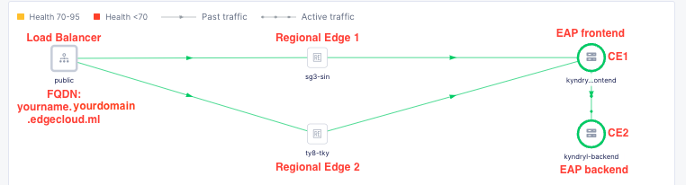
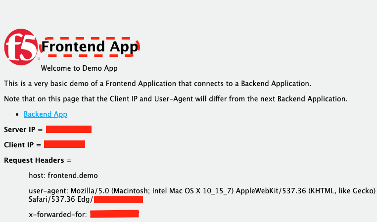
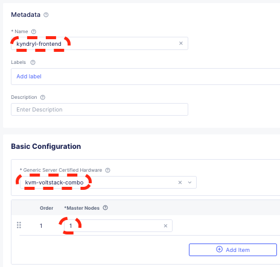
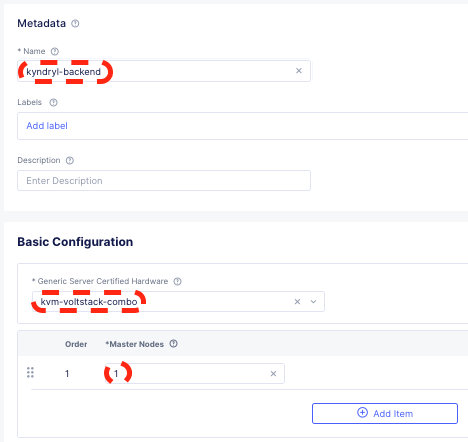
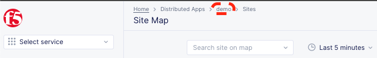

<h2>F5 Distributed Cloud - Edge Application Platform (EAP)</h2>

<h3>Edge Application Platform</h3>

 

<h3>EAP Overview</h3>

 
 
 

<h3>Objectives</h3>
1. Develop fundamental understanding of F5XC Customer Edge Application Platform (EAP) deployment and management 
2. Distributed load-balancing (L3/4/7) 
3. Web Application and API Protection (WAAP) 
4. Basic site-to-site networking, custom advertisement of services, virtual site, K8s
discovery for containerized apps 
5. F5XC operation and security observability and monitoring 

 
<h3>Table of Contents</h3>
<a href="#pre">PRE-REQUISITE<a> 
<a href="#apc">SECTION 1: Prepare App Stack CE Sites</a> 
<a href="#dap">SECTION 2: Deploy the sample Frontend and Backend apps to the App Stack at Customer Sites</a> 
<a href="#cap">SECTION 3: Connect Backend App to Frontend App</a> 
<a href="#cwp">SECTION 4: Configure WAAP</a> 
<a href="#k8s">SECTION 5: Quick Comparison on generic Kubernetes Deployment vs XC vK8s (App Stack)</a> 
<a href="#ack">ACKNOWLEDGEMENT</a> 
 
<h4><a id="pre">PRE-REQUISITE</a></h4>
•	F5 Distributed Cloud credential 
•	Laptop/desktop browser with internet connectivity 
•	Two Virtual Machines (as 2x CE sites - CE1 and CE2), either on public cloud or on-premise (VMware/KVM) 
 
<a href="#toc">Table of Content</a>
 
<h4>SECTION 1: Prepare App Stack CE Sites</a></h4>
This section focusses on setting up customer sites (Cloud or Edge) VMs  
1.1) Login to XC account at https://console.ves.volterra.io (Lab tenant will be provided) 
  
1.2) Prepare 2x CE sites in VMware/KVM/Public Cloud (min 4vCPU, 16GB, 64GB storage), totally isolated network environment like VPC/vNET or can be in the same subnet for on-premise 
 
1.3) Navigate to: 

 

1.4) Create/Retrieve your Site Token: Manage > Site Management > Site Tokens 
(Add new Site Token with Name format like yourname-token e.g., yourname-token, copy and keep the UID value (saved it) once Site Token created for later use i.e., copy and paste) 

 

1.5) Create K8s Cluster: Manage > Manage K8s > K8s Clusters 
(Add two new Clusters with Name yourname-frontend and yourname-backend, keep the Name consistent and the same for K8s Cluster, App Stack, and the CE Cluster Name of the App Stack e.g., yourname-frontend and yourname-backend) 
1.5.1) yourname-frontend 

 
 
1.5.2) yourname-backend 

 
 

1.6) Create App Stack Site: Manage > Site Management > App Stack Sites 
(Add two new App Stack Sites with Name: yourname-frontend and yourname-backend) 
1.6.1) yourname-frontend 

 
1.6.2) yourname-backend 

 

1.7) Use the Site Token UID value copied earlier to initialise the two Customer Sites (Cloud or Edge) 

1.8) Instantiate two Customer Sites (Cloud or Edge) for both App Stack Sites. If using Public Cloud like AWS/Azure/GCP then create cloud credential, otherwise download KVM/VMware <a href="https://docs.cloud.f5.com/docs/images">images</a> and bring up the two VMs with Internet connectivity 

1.9) Remote login into two Customer Sites (Cloud or Edge) VMs to complete the CE configuration (E.g., ssh userid@vmipaddress with default password, a mandatory password change will be prompted - enter existing and desire new password) 

1st CE 
 
1st CE, enter/select following values and leave other values default 
(Latitude / Longtitude to chart CE location on F5XC map - enter your desire values) 
| Field | Value | 
| --------------- | --------------- |
| Token | Site Token UID value copied earlier |
| Site Name | yourname-frontend |
| Hostname | yourname-frontend |
| Latitude / Longtitude | 1.28 / 103.9 |
| Default Fleet Name | |
| Certified Hardware | kvm-voltstack-combo |  
| Primary Outside NIC | eth0 |

 

2nd CE 
 
2nd CE, enter/select following values and leave other values default 
(Latitude / Longtitude to chart CE location on F5XC map - enter your desire values) 
| Field | Value | 
| --------------- | --------------- |
| Token | Site Token UID value copied earlier |
| Site Name | yourname-backend |
| Hostname | yourname-backend |
| Latitude / Longtitude | 1.28 / 103.9 |
| Default Fleet Name | |
| Certified Hardware | kvm-voltstack-combo |
| Primary Outside NIC | eth0 |

 
  
1.10) Approve New Site Registration: Manage > Site Management > Registrations 
(Click on the two blue ticks on 1st and 2nd CEs to approve the registrations) 
 
 
The New Sites will be moved to Other Registrations after approval 
 
Monitor the New Sites status: Sites > Site List (Until there are online and turned green) 
  

<h4>SECTION 2: Deploy the sample frontend and backend apps to the App Stack at Customer Sites</a></h4>
This section focusses on deploying sample application into customer sites (Cloud or Edge) running App Stack 
 
2.1) Download the Global Kubeconfig files from both sites: Managed K8s > Overview 

 

2.2) Download kubectl binary <a href="https://kubernetes.io/docs/tasks/tools/#kubectl">tool</a> on your laptop (OS supported - Windows/Mac/Linux) 

2.3) Test connectivity from your laptop to the 1st CE K8s cluster node with downloaded kubectl binary and Global Kubeconfig file 
Example of Windows command: 
kubectl --kubeconfig ves_system_yourname-frontend_kubeconfig_global.yaml get all 
Example of Linux/Mac command: 
./kubectl --kubeconfig ./ves_system_yourname-frontend_kubeconfig_global.yaml get all 
 

2.4) Test connectivity from your laptop to the 2nd CE K8s cluster node with downloaded kubectl binary and Global Kubeconfig file and kubectl binary  
Example of Windows command: 
kubectl --kubeconfig ves_system_yourname-backend_kubeconfig_global.yaml get all 
Example of Linux/Mac command: 
./kubectl --kubeconfig ./ves_system_yourname-backend_kubeconfig_global.yaml get all 
 

2.5) To view the name of your F5XC application namespace: Distributed Apps > (refer to breadcrumb value on top) > Sites 
 

2.6) Create your frontend (1st CE) Kubernetes namespace (using the same name as your F5XC application namespace observed at previous step)  
Example of Windows command: 
kubectl --kubeconfig ves_system_yourname-frontend_kubeconfig_global.yaml create namespace demo 
Example of Linux/Mac command: 
./kubectl --kubeconfig ./ves_system_yourname-frontend_kubeconfig_global.yaml create namespace demo 
 

2.7) Create your backend (2nd CE) Kubernetes namespace (using the same name as your F5XC application namespace observed at previous step)  
Example of Windows command: 
kubectl --kubeconfig ves_system_yourname-backend_kubeconfig_global.yaml create namespace demo 
Example of Linux/Mac command: 
./kubectl --kubeconfig ./ves_system_yourname-backend_kubeconfig_global.yaml create namespace demo 
 

2.8) Deploy frontend app using frontend.yaml file (extract frontend.yaml file from downloadable <a href="https://github.com/f5xc/ce-appstack/raw/main/edgeapp.zip">zip file</a>) to your namespace: 
Example of Windows command: 
kubectl --kubeconfig ves_system_yourname-frontend_kubeconfig_global.yaml apply -f frontend.yaml -n demo 
Example of Linux/Mac command: 
./kubectl --kubeconfig ./ves_system_yourname-frontend_kubeconfig_global.yaml apply -f frontend.yaml -n demo 
 

2.9) Deploy backend app using backend.yaml file (extract backend.yaml file from downloadable <a href="https://github.com/f5xc/ce-appstack/raw/main/edgeapp.zip">zip file</a>) to your namespace: 
Example of Windows command: 
kubectl --kubeconfig ves_system_yourname-backend_kubeconfig_global.yaml apply -f backend.yaml -n demo 
Example of Linux/Mac command: 
./kubectl --kubeconfig ./ves_system_yourname-backend_kubeconfig_global.yaml apply -f backend.yaml -n demo 
 

2.10) Validate deployment status for both frontend and backend: 

1st CE
Option 1: Validate frontend pod and service with kubectl binary  
Example of Windows command: 
kubectl --kubeconfig ves_system_yourname-frontend_kubeconfig_global.yaml get pod -o wide -n demo 
kubectl --kubeconfig ves_system_yourname-frontend_kubeconfig_global.yaml get svc -o wide -n demo 
Example of Linux/Mac command: 
./kubectl --kubeconfig ./ves_system_yourname-frontend_kubeconfig_global.yaml get pod -o wide -n demo 
./kubectl --kubeconfig ./ves_system_yourname-frontend_kubeconfig_global.yaml get svc -o wide -n demo 
 
Option 2: Validate frontend pod and service on F5XC: Cloud and Edge Sites > Manage > Manage K8s > Deployments > frontend > Running Pods 
 

2nd CE
Option 1: Validate backend pod and service with kubectl binary, example of linux commands: 
Example of Windows command: 
kubectl --kubeconfig ves_system_yourname-backend_kubeconfig_global.yaml get pod -o wide -n demo 
kubectl --kubeconfig ves_system_yourname-backend_kubeconfig_global.yaml get svc -o wide -n demo 
Example of Linux/Mac command: 
./kubectl --kubeconfig ./ves_system_yourname-backend_kubeconfig_global.yaml get pod -o wide -n demo 
./kubectl --kubeconfig ./ves_system_yourname-backend_kubeconfig_global.yaml get svc -o wide -n demo 
 
Option 2: Validate backend pod and service on F5XC: Cloud and Edge Sites > Manage > Manage K8s > Deployments > backend > Running Pods 
 

 
<h4>SECTION 3: Connect Backend App to Frontend App</a></h4>
This section focusses on connecting sample applications - Frontend and Backend on customer sites (Cloud or Edge) running App Stack  

3.1) Create the app origin pool for both frontend and backend apps 
Populate the Kubernetes service names and namespace for the app origin pool creation 
Format: servicename.namespace 
Examples: frontend.demo / backend.demo 

3.1.1) 1st CE
| Field | Value | 
| --------------- | --------------- |
| Name | yourname-frontend |
| Virtual-Site or Site or Network | Site |
| Service Name | frontend.demo |
| Select Network on the Site | Outside Network |

yourname-frontend.demo 
 
 
 
 

 

3.1.2) 2nd CE
| Field | Value | 
| --------------- | --------------- |
| Name | yourname-backend |
| Virtual-Site or Site or Network | Site |
| Service Name | backend.demo |
| Select Network on the Site | Outside Network |

yourname-backend.demo 
 
 
 
 

 

3.2) Create TCP Load-balancer exposing backend app (2nd CE) to frontend app (1st CE): 
Distributed Apps > Manage > Load Balancers > TCP Load Balancers > Add TCP load balancer 
 
 
 
 
 
 
 
 

3.3) Create HTTP Load Balancer to expose frontend app to the Internet at Regional Edge (RE) 
Distributed Apps > Manage > Load Balancers > HTTP Load Balancers > Add HTTP load balancer 
 
 
 
 
Example, yourname.yourdomain.edgecloud.ml 
 
 

<h4>SECTION 4: Configure WAAP</a></h4>
This section focusses on setting up Wab Application and API Protection (WAAP)  

<h4>SECTION 5: Quick Comparison on generic Kubernetes Deployment vs F5XC Managed K8s/vK8s (App Stack)</a></h4>
This section focusses on comparing generic Kubernetes Deployment and F5XC Kubernetes  

<a href="#toc">Table of Content</a>

 
<h4>Acknowledgement</h4>
1)	Klark Ooi, Channel Management - APCJ, F5, Lab Author 
 
Please provide your feedback about this Lab session at following URL, thank you! 
 
https://forms.office.com/r/js15ACgWwH 
 
Next labs, Bot Protection, automated (scripted) provision, and more 
Look forward to seeing you again at next lab. 
 

